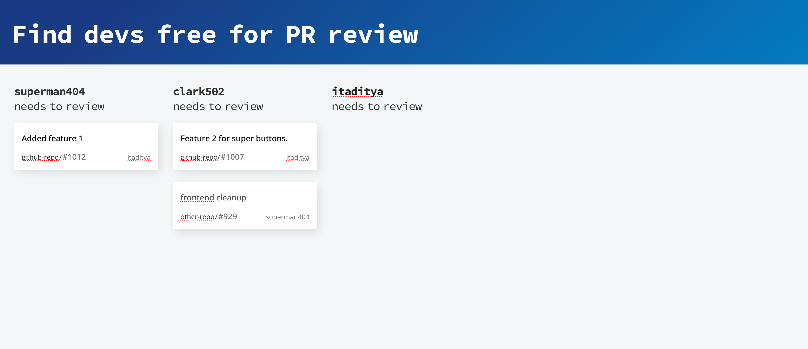

## PR-Train

Before I assign a PR to get reviewed by my teammates I like to check if they are not already swarmed with other review requests. pr-train has two ways to help me know how many PRs does a member already has to review.

1. WebApp: It uses the GitHub org's team slug to get list of team members and then show what PRs each member has to review.
2. Browser Extension: Supported for both Firefox and Chrome, when you open a PR or try to assign someone an existing PR, you'll see the number of PRs each person has to review beside their username right on GitHub.

The API server lives [here](https://github.com/itaditya/pr-train-api-server).
